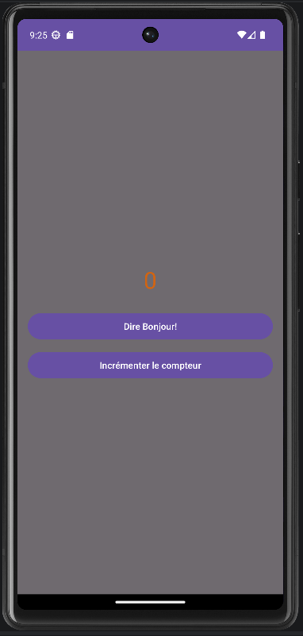
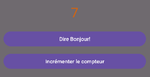

# HelloToast - Android Lab 1

## Fonctionnalités

- Affichage d'un message Toast au clic d'un bouton
- Compteur qui s'incrémente à chaque clic et s'affiche à l'écran

## Structure du projet

- `MainActivity.java` — logique de l'application
- `activity_main.xml` — interface utilisateur

## Screenshots

Écran principal:

Toast affiché:

Compteur incrémenté:

